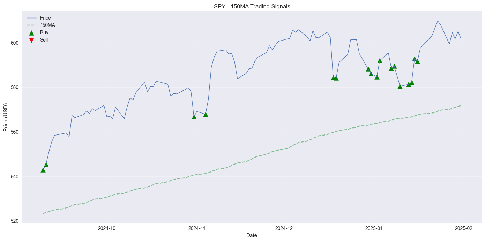

# MA-AlgoTrader 📈

A professional implementation of a 150-day Moving Average (150MA) algorithmic trading strategy with backtesting and visualization.



## Overview
This project automates the execution of a trend-following trading strategy using historical stock data. It identifies entry/exit points based on price movements relative to the 150-day moving average and evaluates strategy performance through vectorized backtesting.

## Key Features
- **Data Pipeline**: Automated download of historical stock data (Yahoo Finance).
- **Signal Generation**: Buy/sell signals based on price-MA crossover logic.
- **Backtesting Engine**: Portfolio simulation with realistic trade execution.
- **Visualization**: Clean matplotlib plots showing price, MA, and signals.

## Installation
1. Clone the repository:
   ```bash
   git clone https://github.com/yourusername/MA-AlgoTrader.git
   cd MA-AlgoTrader
   ```
2. Install dependencies:
    ```bash
   pip install -r requirements.txt
   ```
   
## Usage
Run the strategy for default tickers (AAPL, MSFT, etc.):
```bash
py main.py
```

Example Output:
```bash
Analyzing AAPL...
📈 AAPL Results:
Initial Balance: $10,000.00
Final Balance: $12,450.00
Return: 24.5%
```

## Dependencies
- pandas
- numpy
- matplotlib
- yfinance

## Disclaimer
⚠️ Not financial advice — for educational purposes only. Past performance ≠ future results. Always conduct your own research before trading.